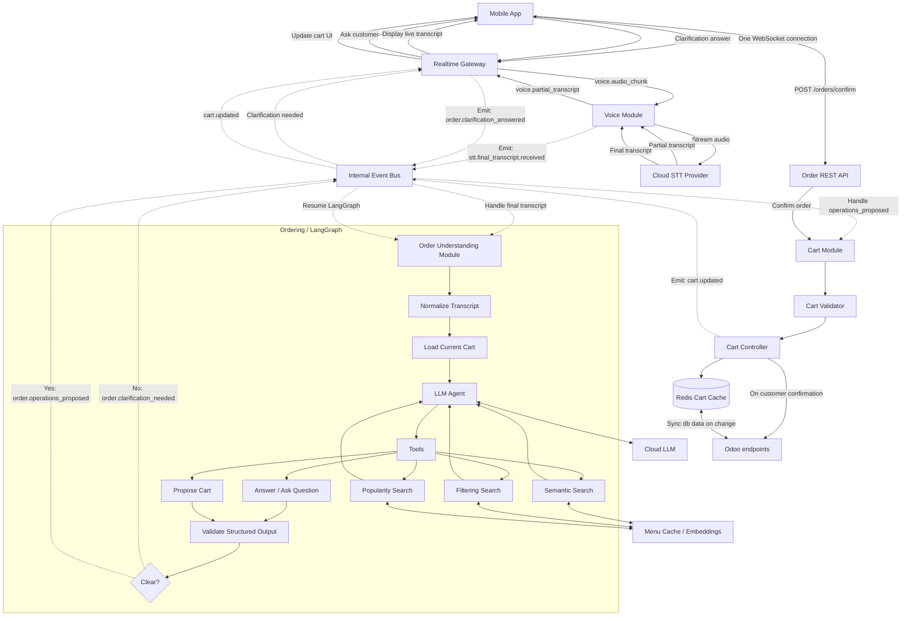
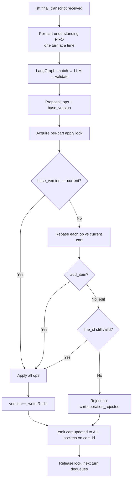
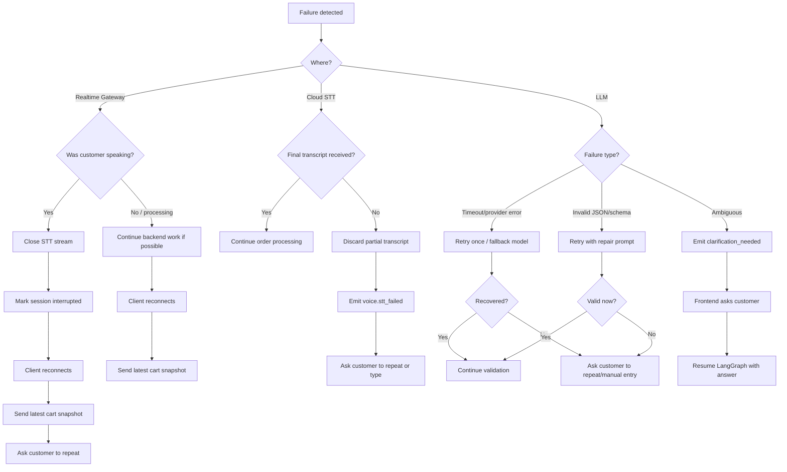

# Voice-Based Ordering — Design

## 1. Overview

Customers place and edit restaurant orders by voice. Speech is transcribed in
real time, interpreted into structured cart operations, validated, and applied —
with the updated cart pushed back to the customer live.

### Functional requirements

- Customer can initiate a voice order.
- Voice is transcribed to text and shown live.
- Voice is turned into structured order records on the backend.
- Customer can edit an existing order in a later voice session.
- Customer can order in any language the restaurant menu supports.
- The updated cart is always visible to the customer.
- Customer can call server to their table
- Integrates with odoo backend

### Non-functional requirements

- Low latency (stream, don't wait for full utterances).
- Availability for ~50 concurrent sessions (size up; better to over-provision).
- Cloud STT/LLM components; everything else can run locally in a monolith.

### Examples

```
"Add two chicken burgers, one without mayo."
Cart:
  2 × Chicken Burger
    - 1 regular
    - 1 no mayo

"I need a large pepperoni pizza and a small Caesar salad."
Cart:
  1 × Large Pepperoni Pizza
  1 × Small Caesar Salad

"Give me three beef tacos, no onions on all of them."
Cart:
  3 × Beef Taco
    - no onions
```

---

## 2. Architecture

An **event-driven modular monolith** in TypeScript. Modules communicate through a
typed in-process event bus; direct function calls are used *within* a module.

```
Events between modules.
Direct calls inside modules.
```

### End-to-end flow

### Core internal events

```
stt.final_transcript.received
order.operations_proposed
order.clarification_needed
order.clarification_answered
cart.updated
cart.operation_rejected
voice.session_failed
voice.session_ended
```

### Module responsibilities (summary)

| Module | Owns | Does NOT do |
|---|---|---|
| Realtime Gateway | WebSocket lifecycle, auth, routing, client registry | Cart logic |
| Voice Module | Voice sessions, STT streaming, emits final transcript | Call LLM, mutate cart |
| Order Understanding (LangGraph) | Transcript → proposed operations / clarification | Mutate cart, audio/WS/STT |
| Menu Candidate Matcher | Retrieve likely items/modifiers before the LLM | Apply operations |
| Cart Module | **Only** mutator of cart state; validate + apply + persist | Interpret speech |

---

## 3. Frontend / Mobile App

- Stream audio continuously instead of waiting for the full utterance — improves
  perceived latency and enables live transcript display.
- Use **one** WebSocket connection to the Realtime Gateway for both voice and cart.
- Partial transcripts are display-only; they do **not** enter the backend event
  flow. Final transcripts trigger backend parsing.
- Treat backend cart snapshots as the source of truth:

  ```
  Receive cart.updated
  → if version is newer than current
  → replace local cart state and update UI
  ```

### WebSocket message types

```
voice.start                   order.clarification_needed     tts.audio_start
voice.audio_chunk             order.clarification_answered    tts.audio_chunk
voice.stop                    order.reply                     tts.audio_end
voice.partial_transcript      cart.updated                    tts.error
                              cart.operation_rejected
                              voice.error
```

### Reconnect behavior

- Use heartbeat / ping-pong to detect dead sockets.
- On reconnect, send `session_id`, `cart_id`, and `last_seen_cart_version`;
  the backend returns a fresh cart snapshot.
- If the socket dropped while actively speaking, ask the customer to repeat the
  last phrase rather than replaying audio.

**Resume request:**

```json
{
  "type": "connection.resume",
  "session_id": "voice_session_123",
  "cart_id": "cart_456",
  "last_seen_cart_version": 8
}
```

**Resume response:**

```json
{
  "type": "connection.resumed",
  "session_id": "voice_session_123",
  "cart_id": "cart_456",
  "cart_version": 9,
  "cart": {},
  "voice_session_status": "idle"
}
```

---

## 4. Realtime Gateway

Owns the single WebSocket connection. Responsible for:

- Accepting connections and authenticating the customer/session.
- Routing incoming `voice.*` messages to the Voice Module.
- Tracking connected clients by `session_id` / `cart_id`.
- Handling heartbeat, disconnect, and reconnect.
- Pushing backend events to the frontend: partial transcripts, voice status,
  clarification questions, cart updates, and errors.

It does **not** own cart logic — it only delivers cart updates produced by the
Cart Module. Prefer pushing cart updates over frontend polling.

---

## 5. Voice Module / STT

Responsible for creating and tracking voice sessions, streaming audio to the
cloud STT provider, relaying partial transcripts back for UI display, and
emitting the final transcript to the event bus. It never calls the LLM or
mutates the cart.

```
Partial:  STT → Voice Module → Realtime Gateway → Mobile App
Final:    STT → Voice Module → Event Bus: stt.final_transcript.received
```

**On socket close while listening:** mark the session disconnected, close the STT
stream, discard partial state, keep the cart unchanged; ask the customer to
repeat on reconnect.

**On socket close after the final transcript was emitted:** continue backend
processing; send the latest cart snapshot on reconnect.

---

## 6. Order Understanding Module (LangGraph)

Converts the final transcript into **proposed** cart operations. It never mutates
the cart — the Cart Module validates and applies.

**Inputs:** final transcript, current cart snapshot, candidate items/modifiers,
restaurant language settings, supported menu languages, session/cart metadata.

**Output:** proposed operations, a clarification question, or a failure result.

### LangGraph responsibilities 
[see details](LLM-graph.md)

Owns multi-turn state, clarification loops (pause/resume), LLM orchestration, and
structured proposal. It does **not** touch raw audio, WebSocket lifecycle, STT,
cart mutation, or payment/confirmation.

```
final transcript
→ normalize transcript
→ load current cart
→ retrieve menu candidates
→ call LLM parser
→ validate structured output
→ decide: propose operations | ask clarification | fail gracefully
```

Use `restaurant_id + ":" + cart_id` as the thread id — the context follows the
**cart**, not a single voice session, since multiple sessions may edit one cart.

### Clarification loop

```
unclear request
→ LangGraph detects ambiguity → emits order.clarification_needed
→ Store session conversation in short-term memory for improved awareness
→ Gateway sends question → customer answers
→ Frontend sends order.clarification_answered
→ LangGraph resumes → proposes operations
→ Cart Module validates and applies
```

---

## 7. Menu Candidate Matcher

Finds likely items/modifiers **before** the LLM call so the whole menu is never
sent — this cuts token cost, improves accuracy, and keeps the prompt controlled.

- Chunk the transcript into likely item/modifier phrases before embedding, so one
  embedding doesn't blend multiple items:

  ```
  "Chicken sandwich and a coke and fries, no pickles"
  → ["Chicken sandwich", "a coke", "fries", "no pickles"]
  ```

- **Hybrid ranking:** embedding similarity + fuzzy match + exact alias match +
  modifier match + popularity/sales + availability filtering.
- Return a small candidate set to the LLM.

### Multi-language matching

Store multiple vectors per item (default-language, translated-language, alias,
modifier). Don't hard-require language detection first:

```
Menu item: Chicken Fried Rice  → [English, Chinese, French, Spanish] vectors

Customer says: "我要鸡肉炒饭"
→ embed customer text once
→ search across all stored vectors
→ group by menu item, rank by best vector match
→ return Chicken Fried Rice
```

### Candidate payload

```json
{
  "items": [
    {
      "menu_item_key": "chicken_sandwich",
      "name": "Chicken Sandwich",
      "matched_text": "Chicken sandwich",
      "score": 0.91,
      "available_modifiers": [
        { "modifier_key": "no_pickles", "name": "No pickles" }
      ]
    },
    { "menu_item_key": "coke",  "name": "Coke",  "matched_text": "a coke", "score": 0.88 },
    { "menu_item_key": "fries", "name": "Fries", "matched_text": "fries",  "score": 0.86 }
  ]
}
```

### Embeddings

- Use the **same** embedding model for menu items, translations, modifiers, and
  customer transcripts. Re-embed an item when its name, description, translation,
  modifier list, or aliases change (or when the model itself changes).
- **Start in-memory** (fine for < ~2,000 items): lower overhead, faster retrieval,
  simpler deploy. Optionally Redis/local cache for faster startup.
- Move to **Postgres + pgvector** when menus grow much larger, many restaurants
  must be searched together, you need persistent indexing / SQL filtering, or
  in-memory reload becomes expensive.

---

## 8. LLM

Multilingual: the customer may speak a supported language, or mix languages in
one sentence. The LLM produces operations using internal **menu keys**, not
display names, and never mutates the cart directly — the Cart Module is the
deterministic source of truth.

**Sees:** customer transcript, current cart snapshot, candidate items/modifiers,
allowed operation schema, restaurant settings, clarification rules. It does **not**
see the full menu unless the menu is very small.

**Output:** strict JSON, schema-validated before use. Invalid output triggers
retry, a fallback model, or clarification.

**Line identity.** `menu_item_key` is the *catalog* identity; a `line_id` is a
stable, per-line identity within a cart. Two lines can share a `menu_item_key`
(e.g. one plain burger + one no-mayo). The LLM resolves references like "the
plain one" from conversational memory and the cart snapshot, but must express the
result as a `line_id` — an **edit** operation (`remove_item`, `update_quantity`,
`add_modifier`, `remove_modifier`) targets a `line_id`; only `add_item` omits it
(the Cart Module assigns one). This keeps the deterministic Cart Module
unambiguous, works for lines added via the app UI or another session (no
conversational history), and lets concurrent-edit conflicts be rejected cleanly.

### Input example

```json
{
  "request_id": "voice_final_abc123",
  "session_id": "voice_session_123",
  "cart_id": "cart_456",
  "restaurant_id": "restaurant_789",
  "customer_text": "Add two chicken burgers, one without mayo.",
  "current_cart": {
    "version": 6,
    "items": [
      { "line_id": "ln_1", "menu_item_key": "chicken_burger", "quantity": 1, "modifiers": [] },
      { "line_id": "ln_2", "menu_item_key": "chicken_burger", "quantity": 1,
        "modifiers": [ { "modifier_key": "no_mayo" } ] }
    ]
  },
  "candidate_items": [
    {
      "menu_item_key": "chicken_burger",
      "name": "Chicken Burger",
      "available_modifiers": [
        { "modifier_key": "no_mayo",      "name": "No mayo" },
        { "modifier_key": "extra_cheese", "name": "Extra cheese" }
      ]
    }
  ],
  "allowed_operations": [
    "add_item", "remove_item", "update_quantity",
    "add_modifier", "remove_modifier", "clarify"
  ]
}
```

### Output example

```json
{
  "operations": [
    { "action": "add_item", "menu_item_key": "chicken_burger", "quantity": 1, "modifiers": [] },
    { "action": "add_item", "menu_item_key": "chicken_burger", "quantity": 1,
      "modifiers": [ { "modifier_key": "no_mayo" } ] }
  ],
  "needs_clarification": false,
  "clarification_question": null
}
```

### Edit output example

"Remove the plain one and make the other a double." — edits target a `line_id`
from the snapshot; `add_item` omits it.

```json
{
  "operations": [
    { "action": "remove_item", "line_id": "ln_1" },
    { "action": "update_quantity", "line_id": "ln_2", "quantity": 2 }
  ],
  "needs_clarification": false,
  "clarification_question": null
}
```

### Clarification output example

```json
{
  "operations": [],
  "needs_clarification": true,
  "clarification_question": "Do you want one chicken burger without mayo, or both without mayo?",
  "clarification_options": [ "one without mayo", "both without mayo" ]
}
```

---

## 9. Cart Module

The **only** module that mutates cart state. Responsible for validating proposed
operations, applying valid ones, rejecting invalid ones, updating the Redis
cache, emitting `cart.updated`, and persisting the confirmed cart to the DB.

**Validation checks:** item exists and is available; modifier exists and is valid
for that item; quantity is valid; **for edits, the target `line_id` exists in the
current cart**; operation is allowed for current cart state; cart version is
current; price/tax rules respected; request not applied twice. The Cart Module
**assigns the `line_id`** on `add_item` and rejects edits to an unknown line
(emits `cart.operation_rejected` — see §11.3 stage 4).

- **Idempotency:** every final transcript carries a `request_id`; never apply the
  same request twice.
- **Versioning:** each update increments the cart version; the frontend ignores
  stale updates.

```
operation proposed
→ Cart Validator → Cart Operation Applier
→ Redis cart cache update
→ emit cart.updated → Gateway pushes to frontend

customer confirms
→ validate final cart → write confirmed order to database
```

### Redis cart cache

Holds active cart state for fast reads/writes during a session; the DB holds
confirmed orders and recovery snapshots. Consider periodic snapshots of active
carts if losing them would be unacceptable.

```
key:  cart:{cart_id}          # cart_id is globally unique; not namespaced by pos_config_id
value: cart_id, pos_config_id, version,
       items: [ { line_id, product_tmpl_id, product_id?, name, quantity,
                  modifiers: [ { ptav_id, name } ],
                  combo_id?, combo_choices?: [ product_id ] } ],
       subtotal_cents, tax_cents, total_cents, last_updated
```

The stored cart speaks Odoo integer ids, not the `menu_item_key`/`modifier_key`
the LLM emits — the Cart Module resolves keys → ids on apply. Full shapes in §17.

### Concurrency on a shared cart

Multiple voice sessions (or the app UI) can edit one `cart_id` at once — usually
the same customer on two devices or a reconnect artifact, so contention is low;
optimize for correctness and clear feedback, not throughput. **Order Understanding
is a pure proposer; the Cart Module is the sole writer.** Two hazards, handled by
two tiers of serialization:

- **Clobbering** — two writers apply against the same version; the second
  overwrites the first.
- **Reordering** — for two utterances on one cart, which reaches the Cart Module
  first is decided by **LLM completion speed, not utterance order**. "Add fries"
  (slow parse) can land *after* "remove fries" (fast parse), leaving fries in the
  cart — the opposite of intent.

#### Tier 1 — per-cart understanding FIFO (fixes reordering)

Final transcripts for a `cart_id` are processed **one turn at a time, in arrival
order**, across all sessions (the thread is already `cart_id`). Turn 2 doesn't
start until turn 1 has run all the way through `cart.updated`, so it sees turn 1's
result and loads a fresh `base_version`. This is why the whole turn serializes,
not just the apply: cross-turn references ("make *that* a double") need turn 2's
snapshot to already include the line turn 1 created.

- **Only cart mutation blocks.** STT keeps listening and partial transcripts keep
  streaming live — the queue delays only the apply-to-cart step, so it's invisible
  except on rapid-fire corrections (~1–3s settle).
- **Clarification stall:** if turn 1 pauses awaiting a clarification answer, turn 2
  blocks behind it. Use a clarification timeout that expires/cancels the pending
  turn so the cart never freezes (one clarification per cart — thread = `cart_id`).
- **Where it lives:** an in-memory `Map<cart_id, Promise>` async chain in the Order
  Understanding module, **in front of** the LangGraph invocation. LangGraph does
  **not** serialize concurrent runs on the same `thread_id`, so the queue must sit
  ahead of it. (Later optimization, skip for MVP: pure `add_item` turns commute and
  could pipeline instead of strictly serializing.)

#### Tier 2 — per-cart apply lock + optimistic version (fixes clobbering)

Out-of-band writers (app UI, another instance, a reconnect) don't pass through the
understanding FIFO, so the Cart Module still guards every apply:

1. **Single writer per cart** — a short per-cart critical section (in-process async
   lock keyed by `cart_id`) makes apply atomic.
2. **Optimistic version check** — each proposal carries `base_version`:
   - `base_version == current` → apply all, `version++`, emit `cart.updated`.
   - `base_version < current` → cart moved under us → **rebase** against the
     current cart rather than trusting the stale snapshot.
3. **Rebase per operation — don't reject the whole batch:**
   - `add_item` → still valid; apply (adds commute; `request_id` dedups retries).
   - edit op (`remove_item` / `update_quantity` / `add_modifier` /
     `remove_modifier`) → re-check the target `line_id` still exists and matches
     intent. If gone/changed → reject **that op** with `cart.operation_rejected`
     (reason: `line_gone` / `stale_edit`) and surface a message; apply the rest.
4. **Broadcast to all participants** — `cart.updated` (with the new `version`) is
   pushed to **every** socket on the `cart_id`, not just the originator; clients
   replace state only on a newer version (§3).



**Scale-out note:** both the in-memory FIFO and the in-process lock only work
within one process. For multiple instances, **shard by `cart_id`** so each cart is
owned by one instance (keeps both mechanisms in-memory) — or, if you need durable
ordering without sticky routing, a per-cart Redis Stream with one consumer per
partition. Avoid Kafka/RabbitMQ until forced.

---

## 10. Recommended high-level sequence

```
1.  Customer starts a voice session; app opens/reuses the WebSocket.
2.  App sends voice.start, then streams voice.audio_chunk messages.
3.  Gateway routes chunks to the Voice Module → Cloud STT.
4.  STT returns partial transcripts → Voice Module → Gateway → frontend (live).
5.  STT returns final transcript → Voice Module emits stt.final_transcript.received.
6.  Order Understanding handles it: load cart → match candidates → LLM parse → validate.
7.  Emit order.operations_proposed, or order.clarification_needed.
8.  If clarification: Gateway asks → customer answers → LangGraph resumes → proposes.
9.  Cart Module validates → updates Redis → emits cart.updated.
10. Gateway pushes cart.updated → frontend updates UI.
11. Customer confirms → Cart Module writes the final order to the database.
```

---

## 11. Failure handling

Three external dependencies can fail: the Realtime Gateway (WebSocket), Cloud STT,
and the LLM. Invariants shared across all three:

- **No final transcript ⇒ never touch the cart.** A final transcript ⇒ safe to parse.
- **LLM output is never trusted directly** — the Cart Module validates and applies.
- **Versioning** ignores stale updates; **idempotency keys** (`request_id`)
  prevent double-apply.
- Active cart lives in **Redis**, so a dropped connection never loses cart state.

### Decision tree



### 11.1 Realtime Gateway (WebSocket)

Risk: customer loses live transcript / cart / clarification updates.

- **Causes:** network loss, unexpected socket close, backend crash, LB idle
  timeout, overload, deploy mid-session.
- **Detect:** client + server heartbeat timeout, socket close/error handlers,
  connection-count / event-loop-lag metrics, LB health checks.
- **Client:** stop audio → show "Reconnecting…" → reconnect with `session_id`,
  `cart_id`, `last_seen_cart_version` (see §3) → apply fresh snapshot.
- **Backend:** mark disconnected, close STT stream if listening, keep cart in
  Redis, allow reconnect for a short window.
- **Timing:** dropped while speaking → discard partial, ask customer to repeat;
  dropped after final transcript emitted → processing continues, send latest
  snapshot on reconnect.
- **Recovery:** exponential-backoff reconnect + fresh snapshot + version guard +
  idempotency keys.

User messages: `"Connection lost. Reconnecting…"` /
`"Reconnected. Your cart is up to date."` /
`"I lost the connection while listening. Please repeat your last sentence."`

### 11.2 Cloud STT

Risk: no transcript, or acting on an incomplete one.

- **Causes:** STT socket close, timeout, rate limit, bad audio, network error,
  no/low-confidence speech, auth error, outage.
- **Detect:** socket close/error + provider close codes, no-transcript timeout,
  final-transcript timeout after `voice.stop`, audio sequence gaps.

| Case | Handling | User message |
|---|---|---|
| A. Fails before audio | retry 1–2×, optionally switch provider; else notify | "Speech recognition is unavailable. Please try again or type your order." |
| B. Closes mid-speech | mark interrupted, discard partial, emit `voice.stt_failed`, ask repeat (**never** parse partial as final) | "Speech recognition disconnected. Please repeat your last sentence." |
| C. `voice.stop` but no final in 2–5s | fail the session, ask repeat | "I did not catch that. Please try again." |
| D. Closes after final transcript | continue Order Understanding; close is cleanup/logging only | — |

- **Retry (MVP):** before audio → retry once; mid-stream → don't retry, ask
  repeat; after final → no retry. *Later:* buffer last 2–5s of audio, reconnect,
  replay, dedupe (not MVP).
- **Events:** `voice.stt_failed`, `voice.session_interrupted`,
  `voice.no_speech_detected`, `voice.final_transcript_timeout`.

```json
{ "event": "voice.stt_failed", "session_id": "voice_session_123", "cart_id": "cart_456",
  "reason": "stt_socket_closed_before_final_transcript", "provider": "assemblyai" }
```

Fallback: ask to repeat, offer manual text entry, optionally switch to a backup provider.

### 11.3 LLM

Risk: invalid operations or misread intent. The LLM only **proposes**; the Cart
Module validates and applies.

- **Causes:** timeout, provider error, rate limit, invalid JSON, schema failure,
  hallucinated menu key, invalid modifier, ambiguity, low confidence, oversized
  prompt, model unavailable.

| Stage | Trigger | Handling | User message |
|---|---|---|---|
| 1 | Request fails (timeout/provider) | retry once, optionally fallback model; else ask repeat / manual | "I had trouble understanding that. Please try again." |
| 2 | Invalid JSON | retry with stricter repair prompt; else fail gracefully | — |
| 3 | Valid JSON, schema fails | retry once with the validation errors; else clarify/fail | — |
| 4 | Schema-valid but business-invalid (bad key, unavailable item, wrong modifier, remove missing line) | Cart Validator rejects → emit `cart.operation_rejected` → clarify | "Chicken Burger does not support that modifier. Would you like it regular?" |

---

## 12. Implementation notes

### Language: TypeScript

The system is JSON-heavy, needs typed WebSocket messages and schema validation
for LLM I/O, and benefits from shared frontend/backend types. LangGraph JS fits
the ordering module, and STT/LLM/embedding providers have strong TS SDK support.

**Approach:** start as a TypeScript modular monolith with clean module
boundaries. Extract the Voice/Realtime Gateway into Go **later, only if** it
becomes the bottleneck (Go wins on high concurrency, low memory, local audio
processing, and strict latency).

Do **not** start with Kafka/RabbitMQ/microservices — a typed in-process event bus
between modules is enough initially.

### Project structure

```
voice-ordering-app/
├── src/
│   ├── app.ts
│   ├── server.ts
│   │
│   ├── config/            env.ts, logger.ts, constants.ts
│   ├── events/            event-bus.ts, event-types.ts, register-handlers.ts
│   │
│   ├── realtime/
│   │   ├── websocket-server.ts
│   │   ├── realtime-gateway.ts
│   │   ├── message-router.ts
│   │   ├── client-registry.ts
│   │   ├── realtime-message-types.ts
│   │   └── register-handlers.ts
│   │
│   ├── voice/             voice-session.ts, voice-session-manager.ts,
│   │                      voice-message-handler.ts, register-handlers.ts
│   │
│   ├── stt/               stt-client.ts, stt-provider.ts, assemblyai-client.ts,
│   │                      deepgram-client.ts, stt-types.ts
│   │
│   ├── ordering/
│   │   ├── order-understanding-service.ts
│   │   ├── register-handlers.ts
│   │   ├── graph/         order-graph{,-state,-nodes,-edges,-checkpointer}.ts
│   │   ├── nodes/         normalize-transcript, load-cart, retrieve-candidates,
│   │   │                  parse-order, validate-operations, ask-clarification,
│   │   │                  resolve-clarification  (*.node.ts)
│   │   └── schemas/       cart-operation, order-graph-input,
│   │                      order-graph-output, clarification  (*.schema.ts)
│   │
│   ├── menu/              menu-service.ts, menu-cache.ts, candidate-matcher.ts,
│   │                      embedding-service.ts, fuzzy-matcher.ts,
│   │                      modifier-matcher.ts, menu-repository.ts, menu-types.ts
│   │
│   ├── llm/               llm-client.ts, llm-provider.ts, openai-client.ts,
│   │                      gemini-client.ts, groq-client.ts, prompt-builder.ts
│   │
│   ├── cart/             cart-service.ts, cart-controller.ts, cart-validator.ts,
│   │                      cart-repository.ts, cart-operation-applier.ts,
│   │                      cart-events.ts, cart-types.ts, register-handlers.ts
│   │
│   ├── redis/             redis-client.ts, cart-cache.ts
│   ├── db/                db.ts, migrations/, schema/*.sql
│   ├── observability/     metrics.ts, event-loop-monitor.ts, structured-logger.ts
│   ├── auth/              auth-middleware.ts, session-auth.ts, auth-types.ts
│   ├── api/               health / cart / menu / voice .routes.ts
│   └── shared/            errors.ts, result.ts, ids.ts, time.ts, types.ts
│
├── scripts/               migrate.ts, seed-menu.ts, refresh-embeddings.ts
├── docs/                  architecture.md, event-flow.md,
│                          api-contracts.md, prompt-contract.md
├── package.json
├── tsconfig.json
├── .env.example
└── README.md
```

---

## 13. Performance & capacity

### Latency SLOs (p50 / p95 per stage)

Budget the pipeline so the LLM — the only stage you can meaningfully move — gets
the biggest slice.

| Stage | p50 | p95 | Driver |
|---|---:|---:|---|
| audio → first partial transcript | 150 ms | 300 ms | streaming STT |
| end-of-speech → final transcript | 400 ms | 800 ms | STT endpointing / silence window |
| candidate match (embed + vector search) | 120 ms | 250 ms | cloud embed round-trip + in-mem search (<1 ms) |
| LLM parse (~1k in / 200 out) | 500 ms | 1,200 ms | model choice (Groq fast, nano/Flash-Lite slower) |
| validate + apply + Redis | 15 ms | 50 ms | apply lock + GET/SET |
| emit + WebSocket push | 20 ms | 80 ms | |
| **final transcript → `cart.updated`** | **~0.7 s** | **~1.5 s** | sum of the four middle rows |
| **stopped speaking → cart visible** | **~1.1 s** | **~2.3 s** | final + pipeline |

### Capacity — reconciling the cost-table assumptions

Two independent axes: **concurrency** sizes infrastructure; **monthly volume**
sizes variable cost. The bridge between them:

```
1,800 audio-hr/mo ÷ 730 hr/mo    = ~2.5 avg concurrent streams
meal-time peakiness (~20×)        → ~50 peak concurrent   ← matches the SLO
1,800 hr × 3600 ÷ 100,000 parses  = ~65 s of active audio per parse
                                    (≈ one final transcript per ~1 min of talking)
```

That last line is the assumption that makes 1,800 hr and 100k parses mutually
consistent — stated explicitly so it can be checked. Business-driver alternative:
`parses/mo = restaurants × orders/day × parses/order × 30`.

### Infra sizing at 50 concurrent

Key point: **STT streams scale 1:1 with sessions; LLM calls do not.**

| Resource | At 50 concurrent | Note |
|---|---|---|
| WebSocket connections | 50 | trivial for Node |
| Open STT streams | 50 | **check the provider's concurrency cap** — the real 1:1 constraint |
| In-flight LLM calls | ~1–10 (not 50) | fire only on a final transcript (~every 65 s), last ~1 s → demand ≈ parses/s × latency |
| Menu embeddings in RAM | ~60 MB | <10k vectors × 1,536 dims × 4 B |
| Redis (active carts) | a few MB | KB per cart |

Provision STT concurrency for peak; LLM and RAM footprints stay small.

---

## 14. STT + LLM cloud options

Assumptions: 1,800 active audio hours/month; 100,000 parse calls/month; 1,000
input + 200 output tokens per parse ⇒ 100M input + 20M output tokens/month.
See §13 for how these reconcile with the ~50-concurrent SLO.

| Stack | STT | LLM parse | Monthly total |
|---|---:|---:|---:|
| **AssemblyAI streaming + Groq gpt-oss-20b** | $270 | $13.50 | **$283.50** |
| AssemblyAI streaming + Gemini 2.5 Flash-Lite | $270 | $18 | $288 |
| AssemblyAI streaming + OpenAI gpt-5.4-nano | $270 | $45 | $315 |
| Deepgram Nova-3 + Groq gpt-oss-20b | $522 | $13.50 | $535.50 |
| Deepgram Nova-3 + Gemini 2.5 Flash-Lite | $522 | $18 | $540 |
| Deepgram Nova-3 + OpenAI gpt-5.4-nano | $522 | $45 | $567 |
| Deepgram Flux + OpenAI gpt-5.4-mini | $702 | $165 | $867 |
| Amazon Transcribe + OpenAI gpt-5.4-nano | $1,080 | $45 | $1,125 |
| Google Speech-to-Text + Gemini 2.5 Flash-Lite | $1,728 | $18 | $1,746 |
| Azure Speech + OpenAI gpt-5.4-nano | $1,800 | $45 | $1,845 |
| OpenAI realtime whisper + OpenAI gpt-5.4-nano | $1,836 | $45 | $1,881 |

**Embeddings** add **~$0.20/month** — negligible: menu vectors are embedded once
(<10k vectors, re-embedded only on menu change); query-time embedding of customer
text is ~3–8 M tokens/month at ~$0.02/1M. Not worth a column.

---

## 15. Multi-language support

- Customers may speak a supported or unsupported language.
- **Supported languages:** embed translated text alongside the default text for
  higher accuracy.
- **Unsupported languages:** vector search still works against existing vectors,
  but with lower accuracy.

---

## 16. Future features

- Suggestion / upsell system.
- Vector DB for menu items if the menu grows large (a single markdown/in-memory
  store likely suffices under ~2,000 items; a local vector DB is heavy overhead).

---

## 17. Data Schemas

The authoritative shapes as implemented. Two identity families and two data
stores; contract-facing keys map to Odoo integer ids at the data layer.

### 17.1 Identity families

Our own identities are opaque **text keys**; Odoo (POS) entities are referenced
by their **integer primary key** as a *soft* reference — no cross-schema FK,
because Odoo's ORM owns those tables' lifecycle.

```ts
// Ours (text keys)
type CartId    = string; // "cart_456" — globally unique; it is the Redis cart key
type SessionId = string; // "voice_session_123"
type RequestId = string; // "voice_final_abc123" — idempotency key
type LineId    = string; // "ln_1" — assigned by the Cart Module

// Odoo POS (integer soft refs)
type PosConfigId      = number; // pos_config.id (the "restaurant")
type ProductTmplId    = number; // product_template.id (menu item / catalog)
type ProductId        = number; // product_product.id (sellable variant)
type PtavId           = number; // product_template_attribute_value.id (a modifier)
type RestaurantTableId = number; // restaurant_table.id
type PosOrderId       = number; // pos_order.id (confirmed order)

// Values
type LangCode = string; // Odoo res.lang code, e.g. "en_US", "zh_CN" (not bare "en")
type Cents    = number; // integer minor units
```

### 17.2 Two data stores

| Store | Holds | Ownership |
|---|---|---|
| **Redis** | live active carts **and** our durable app state (cart registry + recovery snapshots, sessions, transcripts, clarifications, server calls, idempotency ledger, order-confirmation bridge) | ours |
| **Odoo POS Postgres** | menu (`product_template`/`product_product`), modifiers (`product_attribute*`), categories, combos, floors/tables (`restaurant_table`), restaurants (`pos_config`), **confirmed orders** (`pos_order`) | Odoo ORM — we READ, never alter |

The app has **no local Postgres**. See `src/db/schema/README.md` and
`docs/menu_restaurant_schema.md` for the Odoo POS reference.

### 17.3 Stored cart (Redis)

The Redis value; the Cart Module is its only writer. Odoo integer ids, money in
integer cents.

```ts
interface CartModifier {
  ptav_id: PtavId;
  name: string;              // display name captured at add time
}

interface CartLine {
  line_id: LineId;
  product_tmpl_id: ProductTmplId;
  product_id?: ProductId;    // resolved sellable variant, if known
  name: string;              // display name captured at add time (en_US fallback)
  quantity: number;
  modifiers: CartModifier[];
  combo_id?: number;
  combo_choices?: ProductId[];
}

interface Cart {
  cart_id: CartId;
  pos_config_id: PosConfigId;
  version: number;           // optimistic-concurrency counter (§9)
  items: CartLine[];
  subtotal_cents: Cents;
  tax_cents: Cents;
  total_cents: Cents;
  last_updated: string;      // ISO
}
```

Key: `cart:{cart_id}`. A recovery snapshot mirrors this JSON so the hot cart can
be rebuilt after a loss.

### 17.4 Menu (in-memory cache)

Loaded from Odoo `product_template`; multiple vectors per item drive
cross-language matching (§7/§15).

```ts
interface MenuItem {
  product_tmpl_id: ProductTmplId;
  menu_item_key: string;               // catalog key exposed to the LLM
  names: Record<LangCode, string>;     // Odoo jsonb translations, e.g. { en_US: "Chicken Burger" }
  base_price_cents: number;
  available: boolean;
  modifiers: CandidateModifier[];
}

interface MenuVector { text: string; vector: number[]; }

interface CandidateModifier { modifier_key: string; ptav_id: PtavId; name: string; }

interface CandidateItem {
  menu_item_key: string;               // maps to product_tmpl_id
  product_tmpl_id: ProductTmplId;
  name: string;
  matched_text?: string;
  score?: number;
  available_modifiers: CandidateModifier[];
}

interface CandidateSet { items: CandidateItem[]; }
```

### 17.5 LLM / Order Understanding contract

The LLM speaks catalog **keys** (`menu_item_key` / `modifier_key`), never numeric
ids — the prompt-facing `CartView` deliberately omits `product_tmpl_id`/`ptav_id`
so the model can't confuse one for a `line_id`. See the §8 JSON examples.

```ts
// Prompt-facing cart projection (NOT the stored Cart)
interface CartModifierView { modifier_key: string; name: string; }
interface CartLineView {
  line_id: LineId; menu_item_key: string; name: string; quantity: number;
  modifiers: CartModifierView[]; available_modifiers: CartModifierView[];
}
interface CartView { cart_id: CartId; pos_config_id: PosConfigId; version: number; items: CartLineView[]; }

interface HistoryTurn {
  customer_text: string;
  clarification_question?: string;     // present when the turn was clarified
  clarification_answer?: string;
}

interface OrderGraphInput {
  request_id: RequestId; session_id: SessionId; cart_id: CartId; pos_config_id: PosConfigId;
  customer_text: string; language?: LangCode;
  current_cart: CartView; candidate_items: CandidateItem[];
  history: HistoryTurn[];              // oldest → newest, for reference resolution
  supported_languages: LangCode[];
  clarification_answer?: string;       // present when resuming after a clarification
  clarification_question?: string;
}

// LLM output — validated with zod (single source of truth)
type CartOperation =
  | { action: 'add_item';        menu_item_key: string; quantity: number; modifiers: { modifier_key: string }[] }
  | { action: 'remove_item';     line_id: LineId }
  | { action: 'update_quantity'; line_id: LineId; quantity: number }
  | { action: 'add_modifier';    line_id: LineId; modifier_key: string }
  | { action: 'remove_modifier'; line_id: LineId; modifier_key: string };

interface OrderGraphOutput {
  operations: CartOperation[];
  needs_clarification: boolean;        // true requires a non-null clarification_question
  clarification_question: string | null;
  clarification_options?: string[];
}

// What Order Understanding hands the Cart Module (carries base_version for rebase, §9)
interface OrderProposal {
  request_id: RequestId; cart_id: CartId; pos_config_id: PosConfigId;
  base_version: number; operations: CartOperation[];
}
```

### 17.6 Internal events (`AppEventMap`)

Payloads for the core events in §2. Modules communicate ONLY through these.

```ts
'stt.final_transcript.received': { request_id; session_id; cart_id; pos_config_id; text; language? }
'order.operations_proposed':     { session_id; proposal: OrderProposal }
'order.clarification_needed':    { cart_id; session_id; request_id; question; options? }
'order.clarification_answered':  { cart_id; session_id; request_id; answer }
'cart.updated':                  { cart_id; pos_config_id; version; cart: Cart }
'cart.operation_rejected':       { cart_id; session_id?; request_id; reason; message; operation? }
'voice.session_failed':          { session_id; cart_id; reason }
'voice.session_ended':           { session_id; cart_id }
```

`cart.operation_rejected.reason` is one of `line_gone` / `stale_edit` /
`unavailable_item` / … ; `message` is customer-facing.

### 17.7 WebSocket messages (one socket, §3)

```ts
// Inbound (app → gateway)
{ type: 'voice.start';       session_id; cart_id }
{ type: 'voice.audio_chunk'; session_id; seq; audio }        // audio: base64 PCM/opus
{ type: 'voice.stop';        session_id }
{ type: 'order.clarification_answered'; session_id; cart_id; request_id; answer }
{ type: 'connection.resume'; session_id; cart_id; last_seen_cart_version }

// Outbound (gateway → app)
{ type: 'voice.partial_transcript'; session_id; text }        // display-only
{ type: 'voice.final_transcript';   session_id; text; language? }
{ type: 'order.clarification_needed'; cart_id; request_id; question; options? }
{ type: 'order.reply';              cart_id; request_id; reply }         // spoken clarify/recommend (one merged outcome)
{ type: 'cart.updated';             cart_id; version; cart: Cart }
{ type: 'cart.operation_rejected';  cart_id; request_id; reason; message }
{ type: 'voice.error';              session_id; reason; message }
{ type: 'connection.resumed';       session_id; cart_id; cart_version; cart: Cart; voice_session_status }

// Spoken-reply audio for order.reply (base64 in JSON, no binary frames): audio_start → audio_chunk × N → audio_end (or error)
{ type: 'tts.audio_start';          session_id; request_id; encoding; sample_rate? }  // sample_rate: raw-PCM only
{ type: 'tts.audio_chunk';          session_id; request_id; seq; audio }  // audio: base64 of one standalone file per sentence segment
{ type: 'tts.audio_end';            session_id; request_id }
{ type: 'tts.error';                session_id; request_id; message }
```

### 17.8 Contract keys → Odoo ids

The §7/§8 JSON contract uses keys; the Menu Candidate Matcher maps them to Odoo
rows.

| Contract term | Data-layer identity (Odoo) |
|---|---|
| `restaurant_id` | `pos_config.id` (`pos_config_id`) |
| `menu_item_key` | `product_template.id` (`product_tmpl_id`) / `product_product.id` (`product_id`) |
| `modifier_key` | `product_template_attribute_value.id` (`ptav_id`, carries `price_extra`) |
| table | `restaurant_table.id` (`restaurant_table_id`) |
| confirmed order | `pos_order.id` (`pos_order_id`) |
| `line_id` | ours — assigned by the Cart Module, unrelated to Odoo |